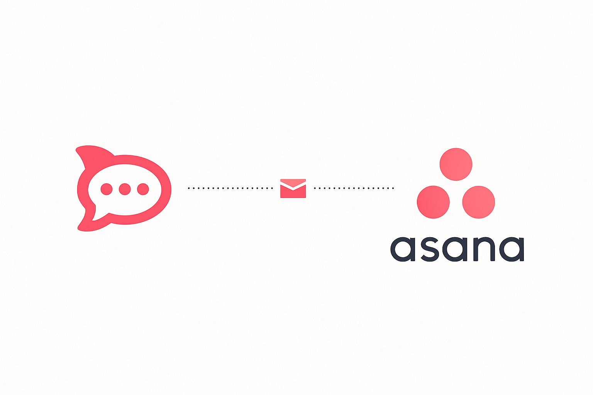

# Asana Integration for Rocket.Chat

<!-- PROJECT LOGO -->
<br />
<div align="center">
  <a href="https://github.com/ZilongXue/asana-rocket-integration">
    
  </a>

  <h3 align="center">Integrate Asana with Rocket.Chat</h3>

  <p align="center">
    <a href="https://github.com/ZilongXue/asana-rocket-integration">View Demo</a>
    ·
    <a href="https://github.com/ZilongXue/asana-rocket-integration/issues">Report Bug</a>
    ·
    <a href="https://github.com/ZilongXue/asana-rocket-integration/issues">Request Feature</a>
  </p>
</div>

<div align="center">

[![Contributors][contributors-shield]][contributors-url]
[![Forks][forks-shield]][forks-url]
[![Stargazers][stars-shield]][stars-url]
[![Issues][issues-shield]][issues-url]
[![MIT License][license-shield]][license-url]

</div>

## 📜 Project Overview

The Asana Integration app provides Rocket.Chat with seamless connectivity to the Asana work management platform. This app allows teams to interact directly with Asana from within Rocket.Chat, offering real-time task notifications, quick commands, and deep linking to make project management more efficient.

Key features:

- View and manage Asana tasks within Rocket.Chat
- Receive real-time updates and notifications for Asana tasks
- Use slash commands to quickly query and manage tasks
- Associate Rocket.Chat rooms with Asana projects
- Complete project management tasks without switching applications

## 🧑‍💻 Mentor
Special thanks to **Gustavo Bauer** for his guidance and support throughout this project.

## 🚀 Getting Started

### Prerequisites

- A set-up Rocket.Chat server
- Rocket.Chat.Apps CLI tool

If you haven't installed the CLI tool yet, run:
```sh
npm install -g @rocket.chat/apps-cli
```

### ⚙️ Installation Steps

1. Clone the repository
   ```sh
   git clone https://github.com/ZilongXue/Apps.Asana.Bridge.git
   ```

2. Install NPM packages
   ```sh
   npm ci
   ```

3. Deploy the app to your Rocket.Chat server
   ```sh
   rc-apps deploy --url <rocket-chat-url> --username <admin-username> --password <admin-password>
   ```

4. After deployment, go to the "Installed Apps" section in the Rocket.Chat admin interface and configure the following required settings:

   ```
   # Asana Client ID
   # Asana Client Secret
   # Asana Redirect URI
   # Asana Webhook Secret
   ```

   These credentials can be obtained from the [Asana Developer Console](https://app.asana.com/0/developer-console). You need to create an OAuth application in Asana and configure permissions.

5. After configuration, save the changes. Make sure to add the Rocket.Chat OAuth callback URL as an authorized redirect URI in the Asana Developer Console.

## 📋 Usage

After installation, users can interact with Asana using slash commands:

```
👋 Asana Integration Help:

  • Use `/asana auth` to authorize and connect to your Asana account
  • Use `/asana tasks` to view your Asana tasks
  • Use `/asana projects` to list your Asana projects
  • Use `/asana task <task_id>` to view specific task details
  • Use `/asana webhook` to manage webhook connections with chat rooms
     - `/asana webhook create <resource_id>` - Create a webhook for a project or workspace
     - `/asana webhook list` - List all your webhooks
     - `/asana webhook delete <webhook_id>` - Delete a webhook
  • Use `/asana summary` to get a work summary
  • Use `/asana logout` to disconnect from Asana
  • Use `/asana help` to view this help information
```

## ✨ Feature Highlights

### OAuth2 Authorization

The app securely connects to users' Asana accounts using OAuth2, eliminating the need to store user passwords in Rocket.Chat.

### Real-time Notifications

Through Asana webhooks, team members can receive real-time notifications when tasks are created, updated, or completed.

### Task Management

View, discuss, and track task progress directly in Rocket.Chat without switching applications.

### Project Collaboration

Associate Rocket.Chat rooms with Asana projects to seamlessly combine team communication and project management.

## 🧑‍💻 Contribution Guidelines

Contributions are welcome! If you have suggestions for improvements, please follow these steps:

1. Fork the project
2. Create a feature branch (`git checkout -b feature/AmazingFeature`)
3. Commit your changes (`git commit -m 'feat: add some feature'`)
4. Push to the branch (`git push origin feature/AmazingFeature`)
5. Create a Pull Request

## 📚 Resources

Here are some useful documentation and resource links:

- [Rocket.Chat Apps TypeScript Definitions Documentation](https://rocketchat.github.io/Rocket.Chat.Apps-engine/)
- [Rocket.Chat Apps TypeScript Definitions Repository](https://github.com/RocketChat/Rocket.Chat.Apps-engine)
- [Rocket.Chat App Examples](https://github.com/graywolf336/RocketChatApps)
- [Asana API Documentation](https://developers.asana.com/docs)
- Community Forums
  - [App Requests](https://forums.rocket.chat/c/rocket-chat-apps/requests)
  - [App Guides](https://forums.rocket.chat/c/rocket-chat-apps/guides)
- [#rocketchat-apps Channel](https://open.rocket.chat/channel/rocketchat-apps)

## 📄 License

This project is distributed under the MIT License. See the `LICENSE` file for more details.

<!-- MARKDOWN LINKS & IMAGES -->
[contributors-shield]: https://img.shields.io/github/contributors/ZilongXue/asana-rocket-integration?style=for-the-badge
[contributors-url]: https://github.com/ZilongXue/asana-rocket-integration/graphs/contributors
[forks-shield]: https://img.shields.io/github/forks/ZilongXue/asana-rocket-integration?style=for-the-badge
[forks-url]: https://github.com/ZilongXue/asana-rocket-integration/network/members
[stars-shield]: https://img.shields.io/github/stars/ZilongXue/asana-rocket-integration?style=for-the-badge
[stars-url]: https://github.com/ZilongXue/asana-rocket-integration/stargazers
[issues-shield]: https://img.shields.io/github/issues/ZilongXue/asana-rocket-integration?style=for-the-badge
[issues-url]: https://github.com/ZilongXue/asana-rocket-integration/issues
[license-shield]: https://img.shields.io/github/license/ZilongXue/asana-rocket-integration?style=for-the-badge
[license-url]: https://github.com/ZilongXue/asana-rocket-integration/blob/main/LICENSE
